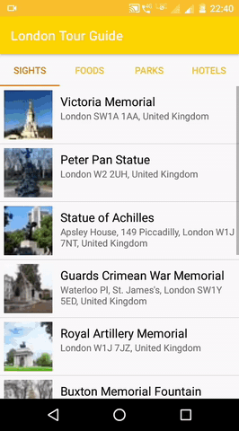

# London-Tour-Guide
 Android Basics by Google Nanodegree Program -  Udacity
 
 ## Project Overview
 The project combine and practice everything learned in lesson 5 of the Nanodegree program. It is a multi-screen Android app to share the knowledge about London city. London Tour Guide App which presents relevant information to a user who’s visiting London city. The app lists top attractions, restaurants, Parks and Hotels in the city. 
 
This project is about combining various ideas and skills practiced throughout the course. They include:
- Planning the app design and navigation before coding.
- Selecting proper data structures to store lists of information.
- Building layouts to display those lists of data.
- Navigating between lists in Fragments using a ViewPager plus TabLayout.
- Creating own custom classes.
- Properly handling images.

## Demo

